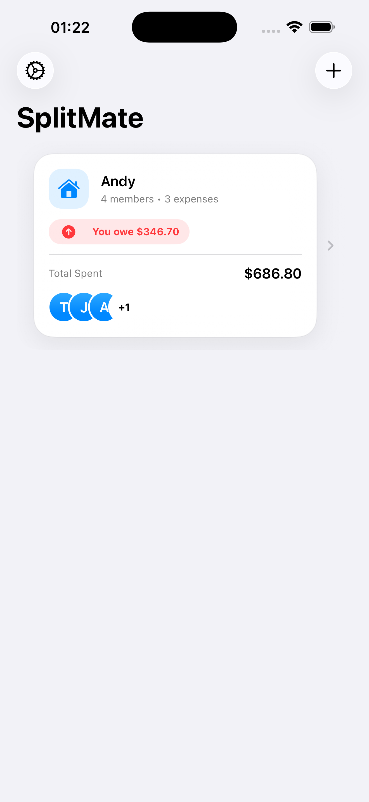
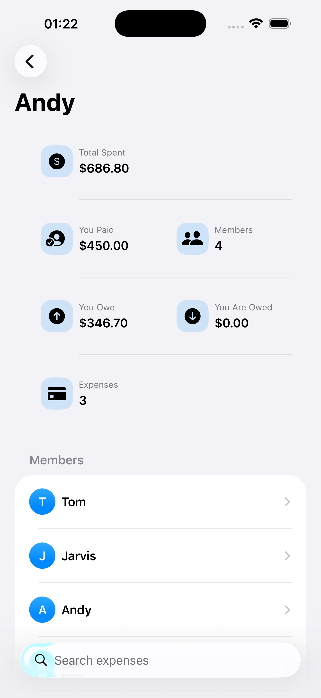
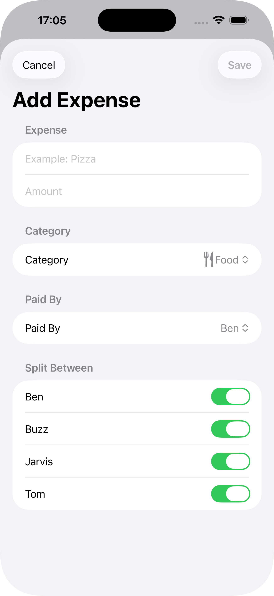
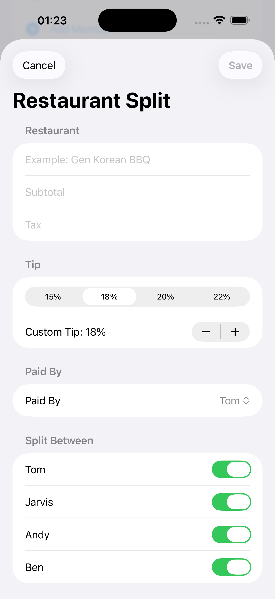
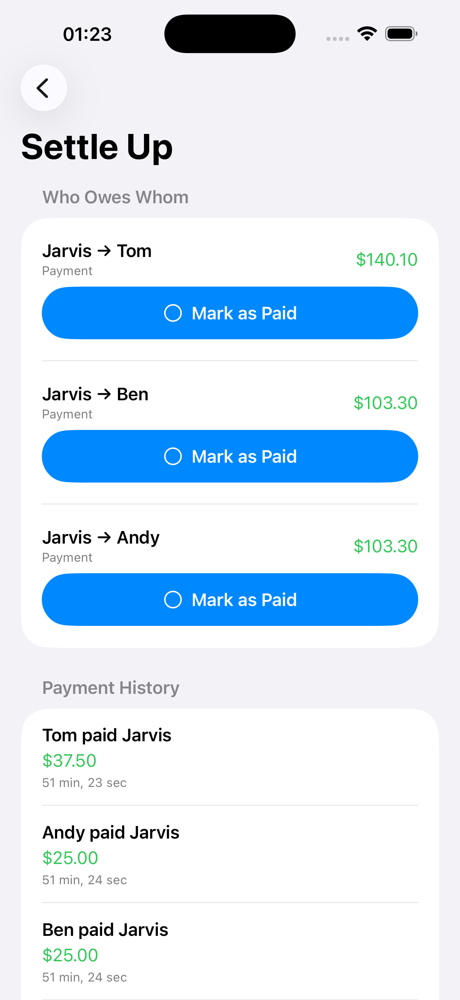
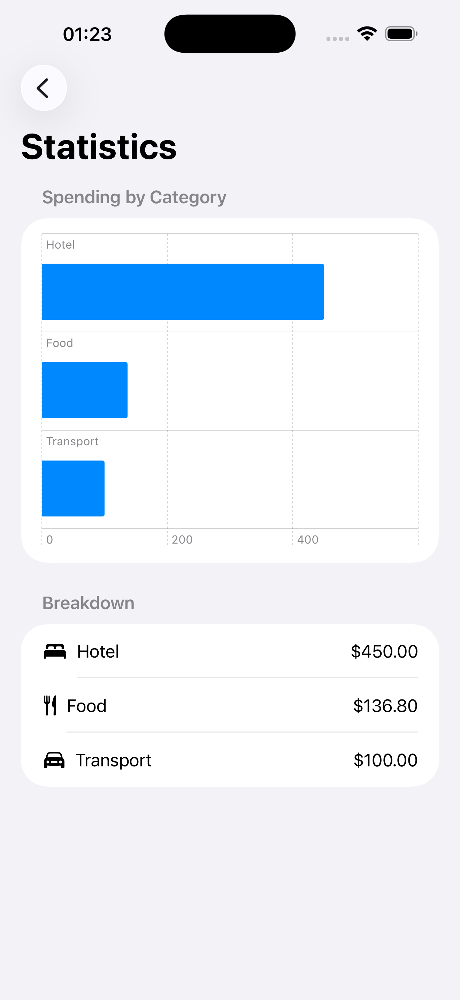

# SplitMate 💸

SplitMate is a modern iOS expense-splitting app built with **SwiftUI** and **SwiftData**. It helps groups of friends, roommates, classmates, or travelers track shared expenses and calculate who owes whom.

---

## 📱 Screenshots

| Home | Group Dashboard | Add Expense | Restaurant Split |
|------|-----------------|-------------|------|
|  |  |  |  |
| Settle Up | Statistics |
|  |  |

---

## ✨ Features

### Groups
- Create and delete groups
- Choose a custom group icon
- Dashboard showing:
  - Total spent
  - Number of members
  - Number of expenses
- Beautiful dashboard cards
- Dark Mode support


### Members
- Add members
- Rename members
- Delete members
- Initial avatar generation
- Automatic balance updates after member removal


### Expenses
- Add expenses
- Edit expenses
- Delete expenses
- Duplicate expenses
- Expense search
- Expense categories
  - 🍕 Food
  - 🚗 Transport
  - 🏨 Hotel
  - 🛍 Shopping
  - 🎉 Entertainment
  - 📦 Other

### Restaurant Split
Restaurant mode includes:
- Subtotal
- Tax
- Tip percentage
- Automatic total calculation
- Equal split
- Cost per person

### Receipt Management
- Attach receipt images
- Full-screen receipt viewer
- Zoomable receipt preview
- Receipt OCR (Vision Framework)

### Balance Calculation
- Automatically calculates balances
- Generates simplified **"Who Owes Whom"** settlements
- Ignores deleted members safely
- Net balances
- Settle-up suggestions

Example:

```
Pizza     $90
Paid by Tom

Participants:
Tom
Alex
Sarah

Result

Alex → Tom      $30

Sarah → Tom     $30
```

### Payments
- Mark as Paid
- Undo payments
- Payment history
- Automatic balance recalculation

###Statistics
Built with **Swift Charts**
- Spending by category
- Total spent
- Number of expenses
- Number of members


### Dashboard
Each group includes:
- Total spent
- You paid
- You owe
- You are owed
- Expense count
- Member count

### Settings
- User profile
- Currency selection
- Light Mode
- Dark Mode
- System Appearance


### Share
Generate and share a beautiful PDF summary containing:
- Group information
- Expenses
- Total spent
- Settlement summary

Perfect for:
- Messages
- AirDrop
- Email
- WhatsApp

---

## Built With
- Swift 6
- SwiftUI
- SwiftData
- Swift Charts
- Vision Framework
- PDFKit
- PhotosUI
- UIKit (Haptics)
- Xcode 16
- iOS 18+

---

## Project Structure

```
SplitMate
│
├── App
│   └── SplitMateApp.swift
│
├── Models
│   ├── Group.swift
│   ├── Member.swift
│   ├── Expense.swift
│   ├── Payment.swift
│   ├── ActivityItem.swift
│   └── AppSettings.swift
│
├── Views
│   ├── ContentView.swift
│   ├── GroupDetailView.swift
│   ├── AddGroupView.swift
│   ├── AddMemberView.swift
│   ├── EditMemberView.swift
│   ├── AddExpenseView.swift
│   ├── EditExpenseView.swift
│   ├── AddRestaurantExpenseView.swift
│   ├── BalanceView.swift
│   ├── StatisticsView.swift
│   ├── ReceiptViewer.swift
│   ├── GroupSummaryPDFView.swift
│   └── SettingsView.swift
│
├── Components
│   ├── GroupRowView.swift
│   ├── DashboardCardView.swift
│   ├── InitialAvatarView.swift
│   ├── ExpenseRowView.swift
│   ├── ZoomableScrollView.swift
│   └── ShareSheet.swift
│
├── Services
│   ├── BalanceCalculator.swift
│   ├── GroupStatsCalculator.swift
│   ├── RestaurantSplitCalculator.swift
│   ├── ReceiptOCRService.swift
│   ├── PDFRenderer.swift
│   ├── ExpenseStatistics.swift
│   ├── ExpenseCategory.swift
│   ├── UserSettingsHelper.swift
│   └── Haptics.swift
│
└── Assets
```

---

## 🧠 How It Works

Each expense stores:

- Title
- Amount
- Category
- Payer
- Participants

SplitMate then:

1. Calculates each participant's share.
2. Computes every member's net balance.
3. Simplifies payments into the minimum number of settlements.

### Example

Expense:

```
Pizza
$90

Paid by:
Alice

Participants:
Alice
Bob
Charlie
```

Each person owes:

```
$30
```

Balances:

```
Alice +60
Bob   -30
Charlie -30
```

Settlement:

```
Bob → Alice      $30

Charlie → Alice  $30
```

---

##  Future Features
- CloudKit sync
- Sign in with Apple
- Shared groups
- Push notifications
- Widgets
- Apple Watch app
- Live Activities
- Multi-language support
- Expense recurrence
- Budget tracking
- AI expense categorization
- Split by item
- Apple Cash integration

---

##  Getting Started

### Requirements

- macOS Sequoia or later
- Xcode 16+
- iOS 18+

### Installation

```bash
git clone https://github.com/yourusername/SplitMate.git
```

Open:

```
SplitMate.xcodeproj
```

Run on an iPhone simulator or physical device.

---

## Learning Goals

This project demonstrates:
- SwiftUI NavigationStack
- SwiftData
- CRUD Operations
- MVVM-inspired architecture
- Reusable Components
- Swift Charts
- PDF generation
- OCR using Vision
- Photos Picker
- Haptic Feedback
- Modern iOS UI Design

## License

This project is licensed under the MIT License.
